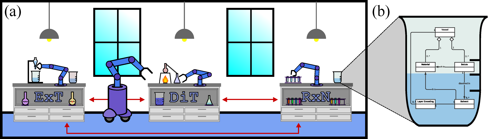

[chemgymrl.com](https://chemgymrl.com/)

# What is ChemGymRL?

A chemistry laboratory environment populated with a collection of chemistry experiment sub-environments, based on the OpenAI Gym environment framework for use with reinforcement learning applications.

ChemGymRL is an environment created to train Reinforcement Learning agents to perform realistic operations in a virtual chemistry lab environment. Such operations are virtual variants of experiments and processes that would otherwise be performed in real-world chemistry labs and in industry. The environment supports the training of Reinforcement Learning agents by associating positive and negative rewards based on the procedure and outcomes of actions taken by the agents.

## What does our environment try to do using Reinforcement Learning?

Similar to real-world chemistry lab experiments, agents are allocated to benches to perform experiments as dictated by a lab manager who has operational control over all agents. Various experiments are performed at each bench in the pursuit of obtaining a specific desired outcome. Most frequently, as in industry, such an outcome is a single material in a high quantity and/or purity. Various avenues of experimentation are explored over several benches whereby Reinforcement Learning agents learn how best to achieve the desired outcome. Once a suitable outcome is obtained, the lab manager concludes the experiment and the results are made available. 

## How does ChemGymRL use Reinforcement Learning?

The ChemGymRL environment leverages Reinforcement Learning algorithms to train agents in the pursuit of achieving an optimal path for generating a suitable outcome by means of a comprehensive rewards system and numerous avenues for achieving such an outcome. In order to navigate the many options for experimentation, the implementation of a lab manager to oversee operations and allocate resources is crucial. The lab manager controls the access of agents to benches as well as the resources made available to agents operating on benches. The results of experimentation are reported to the lab manager who then identifies avenues for future work and continues to allocate agents and resources to benches as necessary. The training of agents working on benches as well as the organization of agents and resources by the lab manager ensures that the intended output is achieved with as few redundant operations as possible.
