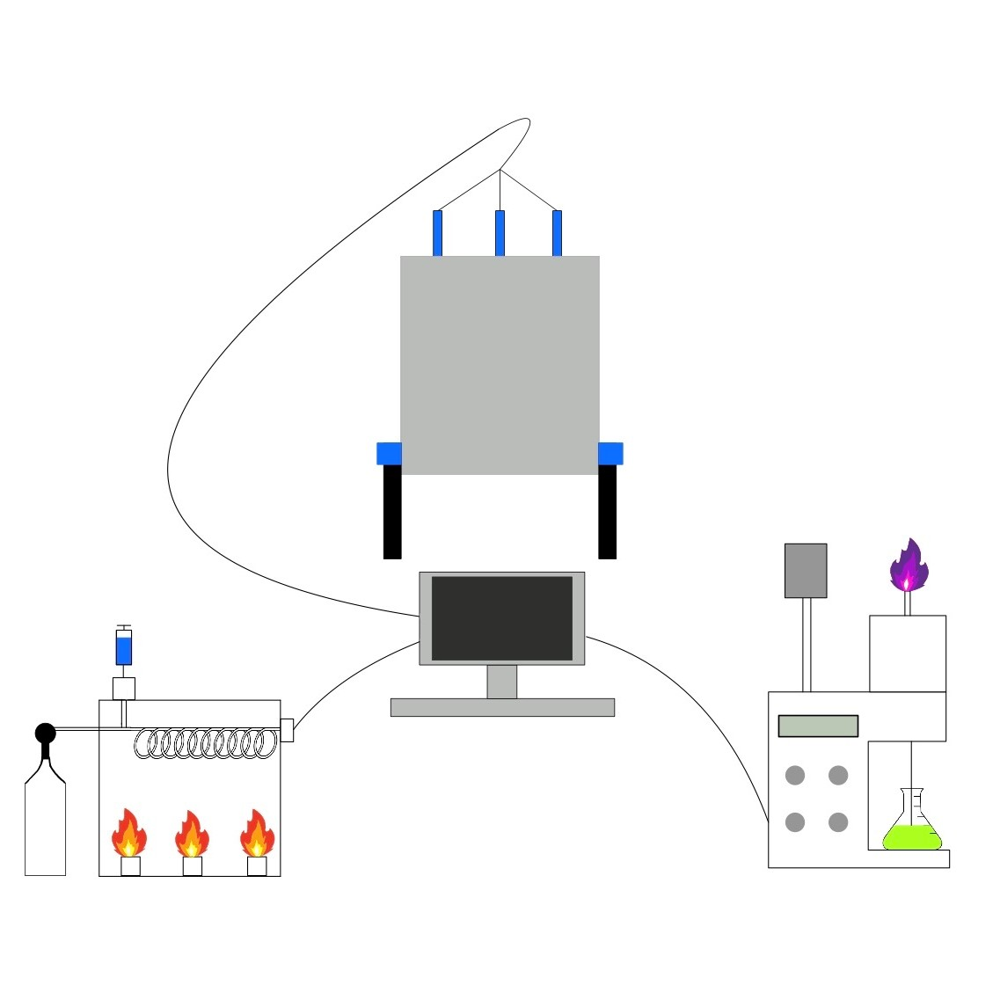

[chemgymrl.com](https://chemgymrl.com/)

# Characterization Bench

<span style="display:block;text-align:center">

The characterization bench is the primary method in which an agent or lab manager can look inside vessel containers. The purpose of the characterization bench is not to manipulate the inputted vessel, but subject it to analysis techniques that observe the state of the vessel including the materials inside it and their relative quantities. This does not mean that the contents of the inputted vessel cannot be modified by the characterization bench. This allows an agent or lab manager to observe vessels, determine their contents, and allocate the vessel to the necessary bench for further experimentation.
 

Included with the characterization bench are several analysis techniques available to the agent working at this bench. The foremost of which is spectrometric analysis. Such analysis includes the observation of spectra being emitted by materials. Performing spectrometry techniques on a vessel produces spectral signatures giving insight into the contents of the vessel. Different materials possess different spectral signatures and cross-checking the produced spectral data with the known spectral signatures of supported materials allows the agent to identify the vessel’s contents. Additional characterization bench techniques are in development.
 

In observing the state of the vessel, the agent or lab manager operating this bench can allocate the vessel to another bench for further experimentation in the pursuit of completing the required task. For example, in the extraction of salt from water, if a vessel is determined to have much more water than salt, the lab manager can use this information to perform further extractions, increasing the purity of salt in the vessel, or subject the vessel to the reaction bench and increase the amount of salt present in the vessel.

## Input

The input to the characterization bench is a vessel, and a set of analysis techniques to perform on the vessel. These are 
passed in as parameters during construction. In order to analyze a vessel, the function get_observation is called.

```python
class CharacterizationBench:
    """
    A set of methods made available to inspect an inputted vessel.

    Args:
    - observation_list (Tuple[str]): Ordered list of observations to make (see Method Map)
    - targets (Tuple[str]): A list of target materials
    - n_vessels (int): The (maximum) number of vessels included in an observation

    Method Map:
    - 'spectra' -> get_spectra
    - 'layers'  -> get_layers
    - 'targets' -> encode_target
    - 'PVT'     -> encode_PVT

    """

    def __init__(self, observation_list,targets,n_vessels):
    .
    .
    .
    def get_observation(self, vessels, target):
        """
        Returns a concatenation of observations of the vessels provided, using the list of observations provided
        in __init__

        Args:
        - vessels (Tuple[Vessel]): A list of vessels you want an observtation of.
        - target (str): The current target material
        """
        self.target=target
        state=np.zeros(self.state_s,dtype=np.float32)
        for i,v in enumerate(vessels):
            if i>= self.n_vessels:break
            state[i] = np.concatenate([f(v) for f in self.functions])
        return np.clip(state.flatten(),0,1)


```

## Output

The output to the characterization bench will depend on the analysis technique called. For example, if the 
characterization bench is called to perform an absorption spectra analysis, it will return a spectral graph back to the 
agent. Currently when analyzing multiple vessels with multiple techniques, the output will be concatenated into a single 1D array.

```python
self.sizes=dict(
    spectra=200,
    layers=100,
    targets=len(targets),
    PVT = 3
)

n_pixels=sum(self.sizes[a] for a in observation_list)
self.observation_shape=(n_vessels*n_pixels,)

```
