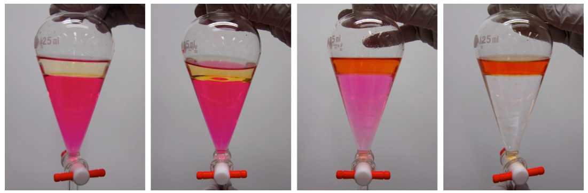

[chemgymrl.com](https://chemgymrl.com/)

# Building A Custom Extraction Bench

For this tutorial, we will be showing you how to create a custom extraction environment to train an RL agent on!

In this case, we will be doing the extraction of Methyl Red from a solution of hydrochloric acid into Ethyl Acetate.
The procedure and set up of this reaction can be found at this
[link](https://chem.libretexts.org/Bookshelves/Organic_Chemistry/Book%3A_Organic_Chemistry_Lab_Techniques_(Nichols)/04%3A_Extraction/4.06%3A_Step-by-Step_Procedures_For_Extractions).
Now let's get started.



<a style="font-size: 10px">(source: https://chem.libretexts.org/@api/deki/files/126179/Nichols_Screenshot_4-5-1.png?revision=1)</a>

The extraction bench is one of the more complicated environments to build since there are a lot more actions to take in
the environment and as a result, a lot more to set up. As a result, we are starting with a very simple, single extraction
but after having implemented this it should be obvious how to extend this to larger more complicated extractions.


## Getting Started:

```python
from chemistrylab import material, vessel
from chemistrylab.benches.general_bench import *
from chemistrylab.chem_algorithms.reward import RewardGenerator
import importlib
from chemistrylab.reactions.reaction_info import ReactInfo, REACTION_PATH
from chemistrylab.lab.shelf import Shelf

```

### Creating a Shelf filled with Vessels

Here we create a shelf containing all of the vessels required for this material. The extraction vessel will have NaCl dissolved in oil, two extra vessels will be provided, one to extract the salt and the other to pour out any waste material (oil).

```python
def make_solvent(mat):
    "Makes a (very large) Vessel with a single material"
    solvent_vessel = vessel.Vessel(
        label=f'{mat} Vessel',
    )
    # create the material dictionary for the solvent vessel
    solvent_class = material.REGISTRY[mat]()
    solvent_class.set_solvent_flag(True)
    solvent_class.mol=1e6
    solvent_vessel.material_dict = {mat:solvent_class}
    # instruct the vessel to update its material dictionary
    return solvent_vessel


extraction_vessel = vessel.Vessel(label='Extract Vessel')
# initialize H2O
C6H14 = material.C6H14(mol=1)
# Get dissolved NaCl
dissolved = material.NaCl().dissolve()
for d in dissolved:
    d.mol=dissolved[d]
mats = [C6H14]+[d for d in dissolved]
# material_dict
material_dict = {mat._name:mat for mat in mats}
# Set up the vessel
extraction_vessel.material_dict=material_dict
extraction_vessel.validate_solvents()
extraction_vessel.validate_solutes()

shelf = Shelf([  
extraction_vessel,
vessel.Vessel("Extract Beaker"),
vessel.Vessel("Waste"),
make_solvent("C6H14"),
make_solvent("H2O")
], n_working = 2)

print(shelf)

```

```
Shelf: (Extract Vessel, Extract Beaker, Waste, C6H14 Vessel, H2O Vessel)
```

### Creating the Actions

Actions are parameterized by a named tuple:
```python
class Action(NamedTuple):
    vessels: Tuple[int]
    parameters: Tuple[tuple]
    event_name: str
    affected_vessels: Optional[Tuple[int]]
    dt: float
    terminal: bool
```

Note: One action object may correspond to multiple actions with different parameters.

For example:
```python
Action([0], [[1],[2],[3],[4]],  'drain by pixel', [1],  0.01, False)
```
corresponds to four actions, each pouring from the vessel at index 0 in the shelf to the vessel at index 1, but each action pours a different number of pixels (from 0 to 4).


```python

#Recall the shelf:         0                1         2          3           4
#           Shelf: (Extract Vessel, Extract Beaker, Waste, C6H14 Vessel, H2O Vessel)

#Setting the volumes to pour (in liters)
amounts=np.linspace(0.2,1,5).reshape([5,1])
#setting the pixels to drain (each pixel represents 10ml of draining in this case)
pixels = np.arange(2,12,2).reshape([5,1])
        
actions = [
    # Pouring the extraction vessel into the extraciton beaker
    Action([0], pixels,              'drain by pixel',[1],  0.01, False),
    # Mixing the extraction vessel
    Action([0],-amounts,             'mix',           None, 0.01, False),
    # Pouring the extraction beaker into the extraction vessel
    Action([1], amounts,             'pour by volume',[0],  0.01, False),
    # Pouring the waste vessel into the extraction vessel
    Action([2], amounts,             'pour by volume',[0],  0.01, False),
    # Pouring the extraction vessel into the waste beaker
    Action([0], amounts,             'pour by volume',[2],  0.01, False),
    # Pouring C6H14 into the extraction vessel
    Action([3], amounts/2,           'pour by volume',[0],  0,    False),
    # Pouring Water into the extraction vessel
    Action([4], amounts/2,           'pour by volume',[0],  0,    False),
    # Waiting for vessels to settle
    Action([0,1,2], 32**amounts/200, 'mix',           None, 0,    False),
    # Ending the experiment
    Action([0], [[0]],               'mix',           None, 0,    True)
]
```

### Determining the Reward Scheme & observations

Since we just want to get the salt out of the oil, we have our reward function discount the reward if C6H14 is present, and set NaCl as our target, making sure to include dissolved components as NaCl. In order to see what we are doing with the extraction, we will set the observation to just return layer information of our vessels.

```python
e_rew= RewardGenerator(use_purity=False, exclude_solvents=True, include_dissolved=True, exclude_mat="C6H14")
#We are trying to extract salt
targets = ["NaCl"]

#Just show layer info
observations = ["layers"]

```

## Making the Bench


```python

class WaterOilExtract_v1(GenBench):
    def __init__(self):
        super().__init__(
            shelf,
            actions,
            observations,
            targets=targets,
            reward_function=e_rew,
        )

```


Now we just have to add some code to allow the new environment to be recognized by gym.

```python

import gymnasium as gym
from gymnasium.envs.registration import register

register(
    id='WaterOilExtract-v1',
    entry_point=__name__+':WaterOilExtract_v1',
)

env = gym.make("WaterOilExtract-v1")

print(env.action_space)
```

