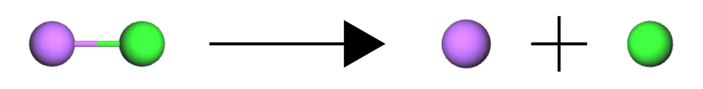

[chemgymrl.com](https://chemgymrl.com/)

## Building A Custom Reaction File

For this tutorial, we are going to be creating a very simple reaction 


NaCl<sub>aq</sub> ->  Na<sup>+</sup><sub>aq</sub> + Cl<sup>-</sup><sub>aq</sub>

To start with creating an environment for this reaction we first have to create a reaction file that simulates
the mechanics of this decomposition. </br></br> In the directory ```chemistrylab/reactions/available_reactions```

For this case, we will create a new reaction file from the reaction template file ```template_reaction.py```,
and let's name it ```decomp.py```.

The first change we have to make is to the list of reactants, products, and solutes located at line 42

```python
REACTION_CLASS = "template reactions"

# names of the reactants and products in all reactions
# a list of the names of all reactants that are to be used in a reaction
REACTANTS = []
# a list of all the names of the reactants that are going to be produced by the reaction
PRODUCTS = []
ALL_MATERIALS = REACTANTS + PRODUCTS
# specify the solute in which the reaction is meant to take place in
SOLVENTS = []
# the desired material out of the reaction
DESIRED = ""
```
we change the above to the following:
```python
REACTION_CLASS = "NaCl decomp"
REACTANTS = ['NaCl']
PRODUCTS = ['Na', 'Cl']
ALL_MATERIALS = REACTANTS + PRODUCTS
SOLVENTS = ['H2O']
DESIRED = 'Na'
```

In this case, we are letting the reaction file know what reagents we are using and the desired product so that we can
easily track and display their concentrations.

Now we need to establish a few arrays that we use to calculate the change in concentration. The first array that we
require is a n_reactions x 1 array which represents the activation energy of each reaction, in this case, we only have 1
reaction:

```python
activ_energy_arr = np.array([1.0])
```

The next array relates to the calculations of the rates of reactions, for this, we use the stoichiometric coefficients
from the reaction to calculate the rates. Since in this reaction, there is 

```python
stoich_coeff_arr = np.array([
        [1.0]
    ])
```

lastly we need to define which reactions are creating a material or using it up:

```python
conc_coeff_arr = np.array([[-1], # concentration for NaCl
                           [1], # concentration for Na
                           [1],  # concentration for Cl
                           [0] # concentration for H2O
                           ])
```

As far as the reaction file, it is now set up and ready to go. 

We are now onto the last 2 additions that will allow us to use this reaction environment. In this file 
```chemistrylab/reaction_bench/reaction_bench_v1.py``` we are going to add some code that will allow us to initialize
our new reaction environment so that we can then register it and use it.

At the bottom of this file we will add the following lines of code:

```python
class ReactionBenchEnv_1(ReactionBenchEnv):
    '''
    Class object to define an environment available in the reaction bench.
    '''

    def __init__(self):
        '''
        Constructor class for the ReactionBenchEnv_0 environment.
        '''

        super(ReactionBenchEnv_1, self).__init__(
            reaction=_Reaction,
            reaction_file_identifier="decomp",
            in_vessel_path=None, # do not include an input vessel
            out_vessel_path=os.getcwd(), # include an output vessel directory
            materials=[ # initialize the bench with the following materials
                {"Material": "NaCl", "Initial": 1},
            ],
            solutes=[ # initialize the bench with the following solutes available
                {"Material": "H2O", "Initial": 1}
            ],
            n_steps=50,
            dt=0.01,
            overlap=False
        )
```

This code simply sets up the environment we will be using. So in this case we establish the materials that the reaction
will use and the initial quantity of that substance in mols. We then also establish our solute, in this case, 1 mol of
water. This takes us to the final step which is registering the environment with gym. In this file: 
```chemistrylab/__init__.py``` we are going to add a few more lines of code.

```python
register(
    id='DecompReact-v0',
    entry_point='chemistrylab.reaction_bench.reaction_bench_v1:ReactionBenchEnv_1',
    max_episode_steps=20
)
```

This code simply tells gym where to find our new environment. Now we're done if you run the following code you should
now be able to see our new environment:
```python
from gym import envs

all_envs = envs.registry.all()
env_ids = [env_spec.id for env_spec in all_envs if 'React' in env_spec.id]
print(env_ids)
```
```
[..., 'DecompReact-v0', ...]
```

Here we can see that our environment has been added!

For additional examples, please check out the other reaction files already created.