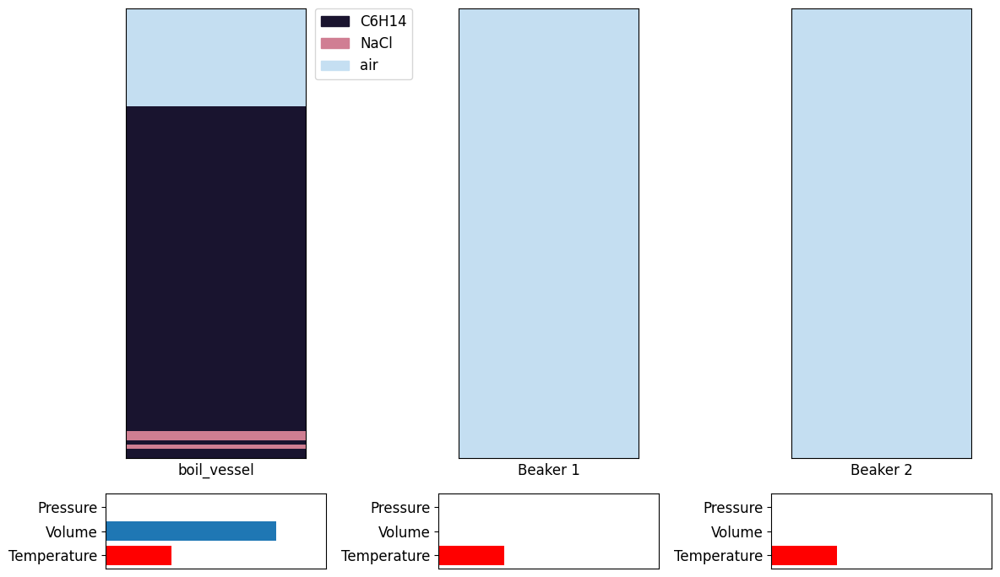

[chemgymrl.com](https://chemgymrl.com/)

## Distillation Bench

<span style="display:block;text-align:center">

The distillation bench provides another set of experimentation aimed at isolating a requested desired material. Similar to the reaction and extraction benches, a vessel containing materials including the desired material is required as input into this bench. The distillation bench utilizes the differing boiling points of materials in the inputted vessel to separate materials between vessels. The intended output from the distillation bench is a vessel containing a sufficiently high purity and amount of the requested desired material.
 
A simple distillation experiment is boiling salt water thus evaporating the water into the air, or into a secondary vessel, leaving only the salt in the initial container. Similarly, the distillation bench obtains a vessel and gradually increases the vessel’s temperature incrementally boiling off materials one at a time. The materials, in their gaseous form, are deposited into an auxiliary vessel, which can be dumped into another auxiliary vessel for storage or removal.

An agent tasked to operate on this bench must control the heat energy added to the vessel as well as the movement of materials between the auxiliary vessels to isolate the desired material with as much purity as possible and spread about as few vessels as possible. Also required of the agent is monitoring the costs associated with adding heat energy and maintenance of unwanted materials. Positive and negative outcomes are associated with actions and operations that lead to the desired material being isolated and of high purity, and thoroughly mixed with unwanted materials and spread about several vessels, respectively.

## Input 

The input to the extraction bench is initialized in the `distillation_bench_v1.py` file.

```python
class Distillation_v1(DistillationBenchEnv):
    '''
    Class to define an environment to perform a distillation experiment
    on an inputted vessel and obtain a pure form of a targetted material.
    '''

    def __init__(self):
        super(Distillation_v1, self).__init__(
            boil_vessel=get_vessel(
                vessel_path=os.path.join(os.getcwd(), "test_extract_vessel.pickle"),
                in_vessel=boil_vessel()
            ),
            reaction=_Reaction,
            reaction_file_identifier="chloro_wurtz",
            precipitation_file_identifier="precipitation",
            target_material="dodecane",
            dQ=1000.0,
            out_vessel_path=os.getcwd()
        )
```

Here we pass the boiling vessel, or a path to the pickle file produced by a previous bench. We provide a reaction
file which identifies the possible targets we are interested in. We also provide a precipitation file which is a
reaction file specifically for describing how various materials dissolve and precipitate out of solution. Like in
the other benches, we also pass the target material. Additionally, we pass in a dQ value which is the maximal change
in heat energy and the path which the output vessel will be located in.

### Distillation Process Explained

In the distillation environment there are 3 main containers or vessels.

- boiling vessel (BV)
- beaker 1       (B1)
- beaker 2       (B2)

The boiling vessel (BV) contains all the materials at the initial state of the experiment. Beaker 1 (B1) can be thought of as a  condensation vessel which is connected to the distillation vessel via a tube and this will contain all the materials that are being boiled off. Beaker 2 (B2) is then the storage vessel, where the condensation vessel can be emptied, in order to make room for other material.


<a style="font-size: 10px">(source: https://pixabay.com/vectors/chemistry-mixture-bulb-violet-161903/)</a>

The point of the process is to extract a target material from the boiling vessel, which contains numerous materials, and we do this by utilizing the different material's boiling points. Typically the process begins by raising the temperature of the BV which allows certain materials in that vessel to boil off into the condensation vessel or B1.


<a style="font-size: 10px">(source: https://pixabay.com/illustrations/chemical-equipment-chemistry-glass-3042414/)</a>

As a material's boiling point is reached, any more temperature added from this point will act to evaporate it. The now gaseous material will rise out of the boiling vessel into the tube that feeds into the condensation vessel where it will condense back into its liquid form. In this virtual experiment  it is assumed that this takes place instantaneously. The amount of material evaporated is dependent on the enthalpy of vapour of material being evaporated.


<a style="font-size: 10px">(source: https://pixabay.com/vectors/chemistry-distillation-experiment-161575/)</a>

Once the entirety of the material has been boiled off, the condensation vessel is drained into the storage vessel. Now
the condensation vessel is empty, the boiling vessel's temperature can then be raised more until the next lowest boiling point is reached, thus repeating the process.


<a style="font-size: 10px">(source: https://thenounproject.com/term/water-evaporate/1639425/.)</a>

The process is repeated until the desired material has been completely evaporated from the boiling vessel into  condensation vessel. From this point on the desired material is completely isolated and we obtain a hopefully pure sample. We can then choose to end the experiment.

In [lesson 3](https://chemgymrl.readthedocs.io/en/latest/lesson_3_distillation/) in these sets of tutorial for the distillation bench, we will try to get a high reward by obtaining a high molar amount of pure dodecane in our condensation vessel.

For this tutorial, we will just familiarize ourselves with the basic actions, fundamental theory behind distillation, and how you can run the environment on your own!

Here we have the different possible actions that we can take with the environment. The **action_set is an array indexed correspondingly to the action we want to perform.**

The action_space is a multidiscrete action space of shape [5 10].

**The first index allows us to choose from the action set. The second index allows us to pick a multiplier that will affect the action variably depending on our chosen multiplier.**

For example, the following pair of numbers will add a great amount of heat compared to a multiplier of 6. 

Action: 0

Action Multiplier: 10

Note that the multiplier affects each action differently. For examply the way the agents chosen multiplier affects heat change is given by the following code:

```python
multiplier = 2 * (multiplier/self.n_actions - 0.5)
heat_change = multiplier * self.dQ
```

Also note that when we are performing heat changes, it heavily relies on the given value of dQ. For our lessons we will be using a dQ of 1000.0. Please make sure to change your dQ value to 1000.0 if you are following this lesson to ensure our results stay the same. You can change this value in the `distillation_bench_v1.py` file under the distillation bench folder.

Typically an agent will choose actions based on what will give a higher reward, and higher reward is given by getting a high molar amount and concentration of the desired material (in our case dodecane) in a particular vessel.

## Output

Once the distillation bench is reset and the render function is called, plots will appear showing data about the distillation 
being performed by the agent. There are two main plot modes:

- Human Render
    - Plots the solvent contents of each vessel with some thermodynamic information. The human render plots a minimal
    amount of data and provides a 'surface-level' understanding of the information portrayed.
    - Sequential pixels corresponding to the same solvent constitute a single layer.


- Full Render
    -  Plots the solvent contents of each vessel, some thermodynamic information, the amount of each material in each vessel.
    The full render plots a significant amount of data for a more in-depth understanding of the information portrayed.



Like the other benches, distillation also saves the vessel once the distillation process is completed. The default name 
for the pickle file is 'distillation_vessel_{i}' where i ranges from 0 to the total number of validated vessels.
