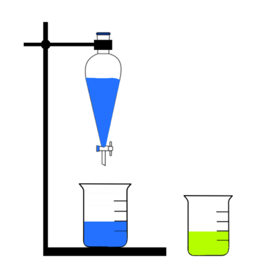
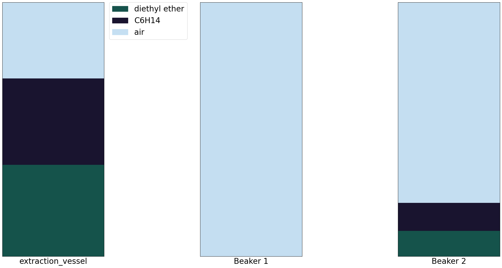

[chemgymrl.com](https://chemgymrl.com/)

# Extraction Bench

<span style="display:block;text-align:center">

The extraction bench aims to isolate and extract certain materials from an inputted vessel container containing multiple materials. This is done by means of transferring materials between a number of vessels and utilizing specifically selected solutes to demarcate and separate materials from each other. The intended output of this bench is at least one beaker, each containing a desired material in quantities that exceed a minimum threshold.
 
A classic extraction experiment is extracting salt from oil using water. Water is added to a beaker containing salt dissolved in oil, settling below the oil. When the water settles, the dissolved salt is pulled from the oil into the water. Similarly, in the extraction bench, solvents are added to act as the oil and water in the previous extraction experiment, separating collections of materials into layers that can be extracted and poured into auxiliary vessels. An agent performing this experiment will be able to use solutes and extract materials with the aim of extracting and isolating the specified desired material.

The agent operating on this bench will experiment using solutes in different scenarios and moving materials between beakers to learn which actions under which circumstances constitute positive and negative results. Positive results resemble actions that increase the purity of the desired material in a vessel or aim to increase the amount of the desired material in a vessel, while negative results include mixing the desired material with a host of unwanted materials. Like in the reaction bench, purity and amount are not the only variables used to facilitate the agent’s learning. Material costs and time constraints are additional factors that the agent must navigate when attempting to maximize the purity and yield of the desired material. Once the costs to continue outweigh the benefits or the required minimum purity threshold is exceeded, all vessels containing a sufficient amount of the desired material are outputted, stored, and made available for further use.

## Input 

The input to the extraction bench is initialized in the `extraction_bench_v1.py` file.

```python
class WurtzExtractDemo_v0(GenBench):
    """
    Class to define an environment which performs a Wurtz extraction on materials in a vessel.
    """

    metadata = {
        "render_modes": ["rgb_array"],
        "render_fps": 60,
    }


    def __init__(self):
        e_rew= RewardGenerator(use_purity=True,exclude_solvents=True,include_dissolved=True)
        shelf = VariableShelf( [
            lambda x:wurtz_vessel(x)[0],
            lambda x:vessel.Vessel("Beaker 1"),
            lambda x:vessel.Vessel("Beaker 2"),
            lambda x:make_solvent("C6H14"),
            lambda x:make_solvent("diethyl ether")
        ],[], n_working = 3)
        amounts=np.ones([1,1])*0.02
        pixels = [[1]]
        actions = [
            Action([0], pixels,              'drain by pixel',[1],  0.001, False),
            Action([0],-amounts,             'mix',           None, 0,     False),
            Action([1], amounts,             'pour by volume',[0],  0.001, False),
            Action([2], amounts,             'pour by volume',[0],  0.001, False),
            Action([0], amounts,             'pour by volume',[2],  0.001, False),
            Action([3], amounts/2,           'pour by volume',[0],  0,    False),
            Action([4], amounts/2,           'pour by volume',[0],  0,    False),
            Action([0,1,2], [[1e-3],[0.016]],'mix',           None, 0,    False),
            Action([0], [[0]],               'mix',           None, 0,    True)
        ]
        
        targets = ReactInfo.from_json(REACTION_PATH+"/chloro_wurtz.json").PRODUCTS

        super(WurtzExtractDemo_v0, self).__init__(
            shelf,
            actions,
            ["layers","targets"],
            targets,
            reward_function=e_rew,
            max_steps=500
        )

    def get_keys_to_action(self):
        # Control with the numpad or number keys.
        keys = {(ord(k),):i for i,k in enumerate("1234567890") }
        keys[()]=7
        return keys
```

Here we pass the extraction we want to perform, in the figure above, we would perform the wurtz extraction. The input 
vessel is also passed here. It contains the material and solute dictionary of a vessel that's typically outputted by the
reaction bench. We also pass the solute that the extraction will take place in, as well as the target material, and path 
of the output vessel.

## Output

Once the extraction bench is ran and the render function is called, plots will appear showing data about the extraction 
being performed by the agent. There are two main plot modes:

- Render
    - Plots the solvent contents of each vessel. The human render plots a minimal amount of data and provides a 
    'surface-level' understanding of the information portrayed.
    - Sequential pixels corresponding to the same solvent constitute a single layer.
  

