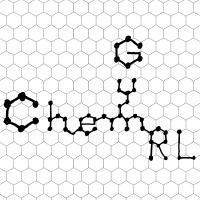

[chemgymrl.com](https://chemgymrl.com/)

Welcome to ChemGymRL's documentation!
=======================================

On this page you will find all of our documentation for ChemGymRL, explaining how the software works, how to install it, and offering explanations and tutorials for each of the individual benches.  

Our documentation is also available via github [here](https://github.com/chemgymrl/chemgymrl/tree/main/docs). If you see an issue with any of the documentation or the code presented in the following pages, feel free to contact us and let us know, or issue a pull request and one of the members of our team will take a look at it!

