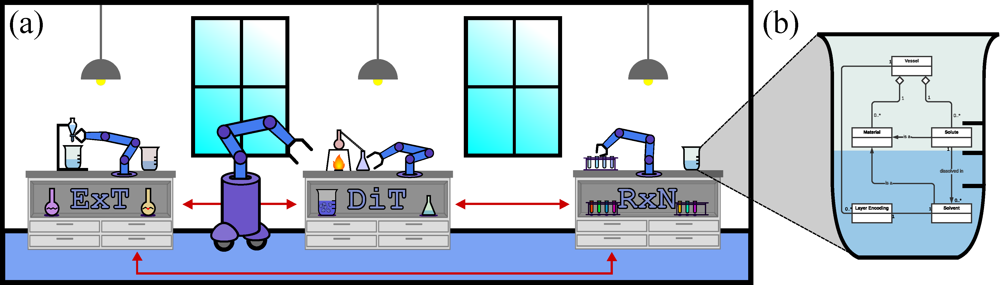

.. chemistrygym documentation master file, created by
   sphinx-quickstart on Wed Jun  7 16:48:37 2023.
   You can adapt this file completely to your liking, but it should at least
   contain the root `toctree` directive.

Welcome to chemistrygym's documentation!
========================================

ChemGymRL is a chemistry laboratory environment populated with a collection of chemistry experiment sub-environments, based on the OpenAI Gym environment framework for use with reinforcement learning applications.

It was created to train Reinforcement Learning agents to perform realistic operations in a virtual chemistry lab environment. Such operations are virtual variants of experiments and processes that would otherwise be performed in real-world chemistry labs and in industry. The environment supports the training of Reinforcement Learning agents by associating positive and negative rewards based on the procedure and outcomes of actions taken by the agents.

.. toctree::
   :maxdepth: 2
   :caption: Documentation:

   chemistrylab

.. toctree::
   :maxdepth: 1
   :caption: Getting Started:
   
   WhatIsChemGymRL
   Installation
   QuickStart

.. toctree::
   :maxdepth: 1
   :caption: User Manual:

   reaction
   extraction
   distillation
   characterization
   Developers
   Glossary
   Troubleshooting

.. toctree::
   :maxdepth: 1
   :caption: Tutorials:

   vessel_lesson
   lesson_1_react
   custom_reaction_lesson
   lesson_1_extract
   custom_extraction_lesson
   lesson_1_distillation

.. toctree::
   :maxdepth: 2
   :caption: Contact:

   About
   Contact
   License

Indices and tables
==================

* :ref:`genindex`
* :ref:`search`
