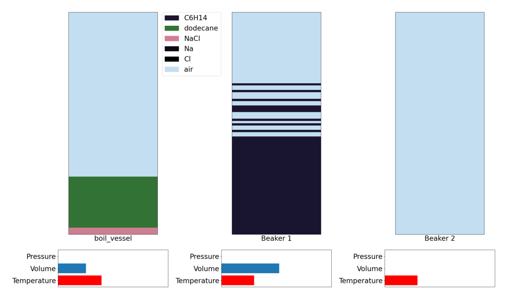
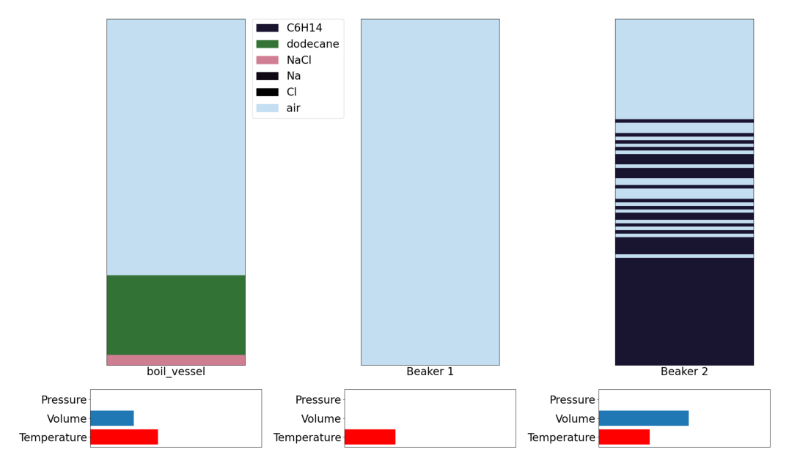

# Distillation Bench: Lesson 1


[](https://colab.research.google.com/github/chemgymrl/chemgymrl/blob/main/lessons/notebooks/distillation_lesson.ipynb)


## Running the environment

We will first start by importing the necessary required modules, both external and local. By now this step should seem very familiar as we have done them in both reaction and extraction lessons.


```python
import gymnasium as gym
import chemistrylab
import matplotlib,time
import numpy as np
from matplotlib import pyplot as plt
from chemistrylab.util import Visualization
from IPython.display import display,clear_output

Visualization.use_mpl_light(size=2)

```

In this tutorial we will be looking at distillation and use GenWurtzDistill-v2 environment. The overall goal of this bench is to separate out a solute dissolved in oil by boiling off the oil. (We also want to separate the solute from any salt if present).


```python
env = gym.make('GenWurtzDistill-v2')
env.reset()
rgb = env.render()
plt.imshow(rgb)
plt.axis("off")
plt.show()
```

We initialize done to False so our agent can run the experiment. We run reset() to return an initial observation.

```
Action 0	boil_vessel: heat contact	([270. 200.])	 -> Beaker 1 
. . .
Action 9	boil_vessel: heat contact	([1000.   30.])	 -> Beaker 1 
Action 10	boil_vessel: pour by volume	([0.])	 -> Beaker 1 
. . .
Action 19	boil_vessel: pour by volume	([1.])	 -> Beaker 1 
Action 20	Beaker 1: pour by volume	([0.])	 -> Beaker 2 
. . .
Action 29	Beaker 1: pour by volume	([1.])	 -> Beaker 2 
Action 30: End Experiment
```

Here is a breakdown of how one of these actions work:

```
Action 0	boil_vessel: heat contact	([270. 200.])	 -> Beaker 1 
```

`Action 0` tells us that this is the first action (call `env.step(0)`). `boil_vessel` is the vessel this action is applied to. `heat contact` is the type of action (this one simulates thermal contact with a reservoir). `([270. 200.])` are the parameters of the action. In this case the first number (270) represents the reservoir temperature and the second number (200) is a heat transfer constant (h*t where h is your heat transfer coefficient and t is time). 


Typically an agent will choose actions based on what will give a higher reward, and higher reward is given by getting a high molar amount and concentration of the desired material (in our case dodecane) in a particular vessel.

### Step 1: Adding temperature to the vessel

`Action 9	boil_vessel: heat contact	([1000.   30.])	 -> Beaker 1`
This will result in the temperature of the vessel increasing.

Repeating this action will result in the temperature reaching the boiling point of oil, and subsequently boil off this oil.

Once all the oil is boiled off the materials dissolved in oil will precipitate out.


```python
_=env.reset()
total_steps=0
total_reward=0
for x in range(4):
    o, r, d, *_ = env.step(9)
    total_reward += r
    time.sleep(0.1)
    clear_output(wait=True)
    print(f'reward: {r}')
    print(f'total_reward: {total_reward}')
    rgb = env.render()
    plt.imshow(rgb)
    plt.axis("off")
    plt.show()
```

    reward: 0
    total_reward: 0
    


    

    


### Step 2: Pour from condensation to storage vessel

`Action 28	Beaker 1: pour by volume	([0.88888889])	 -> Beaker 2`

We can then see that storage vessel is now filled with the oil poured from the condensation vessel.


```python
o, r, d, *_ = env.step(28)
total_reward += r

print(f'reward: {r}')
print(f'total_reward: {total_reward}')
rgb = env.render()
plt.imshow(rgb)
plt.axis("off")
plt.show()
```

    reward: 0
    total_reward: 0
    


    

    


### Step 3: Add some more temperature

`Action 9 boil_vessel: heat contact ([1000. 30.]) -> Beaker 1`

We can now add more temperature in order to boil off our solvent and separate from any salt (if present)


```python
for x in range(4):
    o, r, d, *_ = env.step(9)
    total_reward += r
    time.sleep(0.1)
    clear_output(wait=True)
    print(f'reward: {r}')
    print(f'total_reward: {total_reward}')
    rgb = env.render()
    plt.imshow(rgb)
    plt.axis("off")
    plt.show()
```

    reward: 0
    total_reward: 0
    


    

    


### Step 5: Ending the experiment

`Action 30: End Experiment`


```python
o, r, d, *_ = env.step(30)
total_reward+=r
print(total_reward)
```

    0.5070800876580238
    


### End of the lesson

This concludes the end of our tutorial. Hopefully you got a chance to see how the basic actions in the distillation environment works and see how you can use the agent in RL applications to maximize the distillation of a desired material.


