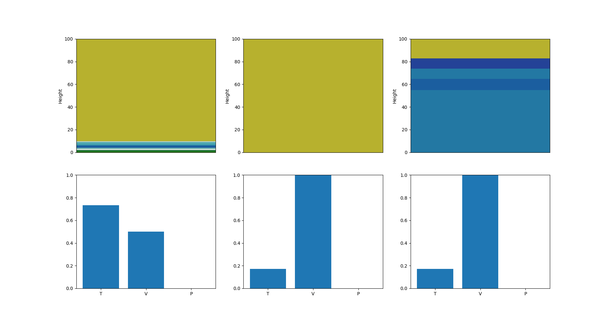

[chemgymrl.com](https://chemgymrl.com/)

## Distillation Bench: Lesson 1

[](https://colab.research.google.com/github/chemgymrl/chemgymrl/blob/rewrite/lessons/notebooks/distillation_lesson.ipynb)

### Running the environment

We will first start by importing the necessary required modules, both external and local. By now this step should seem very familiar as we have done them in both reaction and extraction lessons.


```python
%matplotlib inline
```


```python
# import all the required external modules
import gym
import numpy as np
import os
import pickle
import sys
from time import sleep
from gym import envs
import matplotlib.pyplot as plt
import pandas as pd
```


```python
# ensure all necessary modules can be found
sys.path.append('../../')
sys.path.append("../chemistrylab/reactions") # to access all reactions
```


```python
# import local modules
import chemistrylab 
```

We can see all the possible variations of the distillation bench environment which can vary depending on the input vessel, in this case the generated boil vessel method, as well as the target material. In this and following tutorials our target material will be dodecane.


```python
# show all environments for distillation bench
all_envs = envs.registry.all()
env_ids = [env_spec.id for env_spec in all_envs if 'Distillation' in env_spec.id]
print(env_ids)
```

We then get prompted with a message asking us to choose the environment we want to run. This is based off the indexing in the environment array we saw from the last cell.


```python
# allows user to pick which environment they want to use
# initializes environment
select_env = int(input(f"Enter a number to choose which environment you want to run (0 - {len(env_ids) - 1}): \n"))
env = gym.make(env_ids[select_env])
render_mode = "human" #select how graphs are rendered
```

We initialize done to False so our agent can run the experiment. We run reset() to return an initial observation.


```python
done = False
__ = env.reset()
print('\n')
```

```python
# shows # of actions available
# for distillation bench there are two elements
# action[0] is a number indicating the event to take place
# action[1] is a number representing a multiplier for the event
# Actions and multipliers include:
#   0: Add/Remove Heat (Heat Value multiplier, relative of maximal heat change)
#   1: Pour BV into B1 (Volume multiplier, relative to max_vessel_volume)
#   2: Pour B1 into B2 (Volume multiplier, relative to max_vessel_volume)
#   3: Wait for boil vessel temp to decrease towards room temp (if multiplier == 0, wait until room temp == true)
#   4: Done (Value doesn't matter)

action_set = ['Add/Remove Heat', 'Pour BV into B1', 'Pour B1 into B2', 'Wait','Done']
assert env.action_space.shape[0] == 2

total_steps=0
total_reward=0
```

Note that the multiplier affects each action differently. For examply the way the agents chosen multiplier affects heat change is given by the following code:

```python
multiplier = 2 * (multiplier/self.n_actions - 0.5)
heat_change = multiplier * self.dQ
```

Also note that when we are performing heat changes, it heavily relies on the given value of dQ. For our lessons we will be using a dQ of 10000.0. Please make sure to change your dQ value to 10000.0 if you are following this lesson to ensure our results stay the same. You can change this value in the `distillation_bench_v1.py` file under the distillation bench folder.

```python
class Distillation_v1(DistillationBenchEnv):
    '''
    Class to define an environment to perform a distillation experiment
    on an inputted vessel and obtain a pure form of a targetted material.
    '''

    def __init__(self):
        super(Distillation_v1, self).__init__(
            boil_vessel=get_vessel(
                vessel_path=os.path.join(os.getcwd(), "test_extract_vessel.pickle"),
                in_vessel=boil_vessel()
            ),
            reaction=_Reaction,
            reaction_file_identifier="chloro_wurtz",
            precipitation_file_identifier="precipitation",
            target_material="dodecane",
            dQ=1000.0, # This value
            out_vessel_path=os.getcwd()
        )
```

We will increase this value to speed up the experiement:

```python
    dQ=100000,
```

Typically an agent will choose actions based on what will give a higher reward, and higher reward is given by getting a high molar amount and concentration of the desired material (in our case dodecane) in a particular vessel.


```python
while not done:

    action = np.zeros(env.action_space.shape[0])

    for index, action_desc in enumerate(action_set):
        print(f'{index}: {action_desc}')
    print('Please enter an action and an action multiplier')
    for i in range(2):
        message = 'Action'
        if i == 1:
            message = 'Action Multiplier:'
        action[i] = int(input(f'{message}: '))


    # perform the action and update the reward
    state, reward, done, __ = env.step(action)
    print('-----------------------------------------')
    print('total_steps: ', total_steps)
    print('reward: %.2f ' % reward)
    total_reward += reward
    print('total reward: %.2f ' % total_reward)
    print('Temperature of boiling vessel: %.1f ' % env.boil_vessel.temperature, ' K \n')
    # print(state)
    
    # render the plot
    env.render(mode=render_mode)
    # sleep(1)
    
    #increment one step
    total_steps += 1
```

#### Step 0: Adding temperature to the vessel

- action: 0
- multiplier: 10

This will result in the temperature of the vessel increasing.


Repeating this action will result in the temperature reaching the boiling point of water, which you will notice some of which is now boiled off in beaker_0 (or the condensation vessel).


Once all the water is boiled off the materials dissolved in water will precipitate out.


#### Step 1: Pour from condensation to storage vessel

- action: 2
- multiplier: 10

We can then see that storage vessel is now filled with the H2O poured from the condensation vessel.


#### Step 2: Add some more temperature

- action: 0
- multiplier: 100

We can now add more temperature in order to boil off 1, 2, and 3-chlorohexane into the now empty condensation vessel. The chlorohexanes are boiled off as they have the lowest boiling points in the vessel.


#### Step 3: Pouring again from condensation to storage

- action: 2
- multiplier: 10

We can again pour the contents of the condensation vessel to the storage vessel



#### Step 4: Pour everything from boiling vessel into condensation vessel

- action: 1
- multiplier: 10

Notice now that all the materials are in the condensation vessel.


#### Step 5: Ending the experiment

- action: 4
- multiplier: 0

### End of the lesson

This concludes the end of our tutorial. Hopefully you got a chance to see how the basic actions in the distillation environment works and see how you can use the agent in RL applications to maximize the distillation of a desired material.
