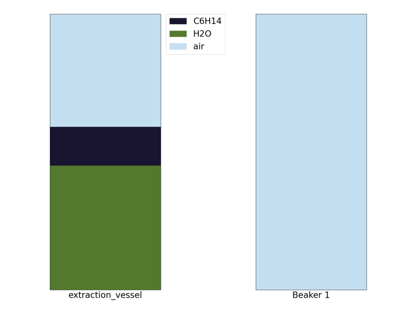
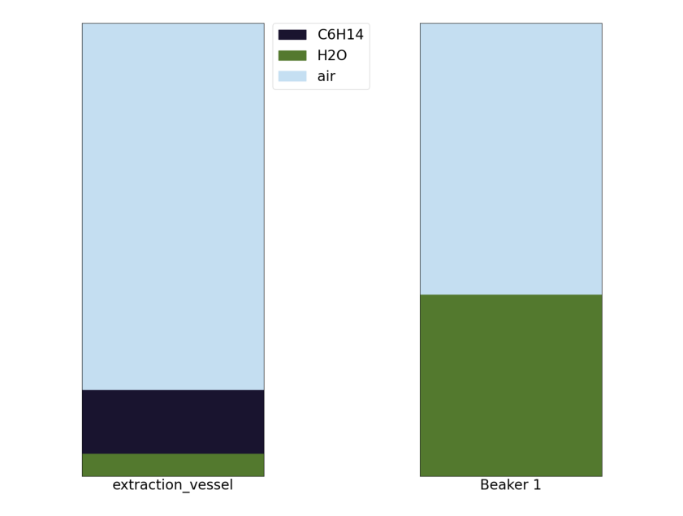

[chemgymrl.com](https://chemgymrl.com/)

# Extraction Bench: Lesson 1

[](https://colab.research.google.com/github/chemgymrl/chemgymrl/blob/main/lessons/notebooks/extraction_lesson.ipynb)

## Using a non-polar solute to extract a solute from water

In this tutorial, I am going to walk you through how our extraction environment works and hopefully give some insight into how an
RL agent might interact with the environment. In this extraction we are going to be using water to extract sodium and
chlorine from oil. We are going to be using this jupyter notebook in order to interact
with the environment.


```python
import gymnasium as gym
import chemistrylab
import matplotlib,time
import numpy as np
from matplotlib import pyplot as plt
from chemistrylab.util import Visualization
from IPython.display import display,clear_output

Visualization.use_mpl_light(size=2)

```

So start by running the code cell below you should see a series of graphs like these appear:

```python
env = gym.make('WaterOilExtract-v0')
env.reset()
rgb = env.render()
plt.imshow(rgb)
plt.axis("off")
plt.show()
```


These graphs show the contents of each of our containers and the level of separation between the materials. The graphs
to the right then show the layers of materials forming in the container.

When we start the environment we will see that we have a container filled with oil, Na and Cl. Using a polar solvent
we can get the sodium and chlorine to diffuse from the oil into that solvent, in this case we can use water as our polar
solvent!


### Step 1: Pour Water into the extraction vessel

`Action 33	H2O Vessel: pour by volume	([0.4])	 -> extraction_vessel `

We can then see that storage vessel is now filled with the oil poured from the condensation vessel.

```python
env.reset()
total_reward = 0
#Pour in water
obs,rew,d,*_ = env.step(33)
total_reward += rew
obs,rew,d,*_ = env.step(39)
total_reward += rew
obs,rew,d,*_ = env.step(39)
total_reward += rew
rgb = env.render()
plt.imshow(rgb)
plt.axis("off")
plt.show()
```


### Step 2: Mix the extraction vessel

`Action 9	extraction_vessel: mix	([-1.])	 -> None`

Now that we've added the water we need to mix the vessel to get the solutes to transfer into the oil, so let's mix the
vessel! As seen in the graph below we can see that based on the layer representation that we have mixed the oil and the water.


```python
obs,rew,d,*_ = env.step(9)
total_reward += rew
rgb = env.render()
plt.imshow(rgb)
plt.axis("off")
plt.show()
```


### Step 3: Wait for the layers to separate

`Action 39	extraction_vessel: mix	([0.16])	 -> None`


Now that we have done some mixing we need to wait for the oil to settle to the top of the water so we can drain the
water. Keep repeating the following command until the graph settles.


```python
obs,rew,d,*_ = env.step(39)
total_reward += rew
obs,rew,d,*_ = env.step(39)
total_reward += rew
rgb = env.render()
plt.imshow(rgb)
plt.axis("off")
plt.show()
```

### Step 4: Pouring out the Saltwater

`Action 4	extraction_vessel: drain by pixel	([10])	 -> Beaker 1`:


Now that the water and oil have settled we want to drain out our water into beaker 1 so that we can pour out our oil
out as waste.


```python
#Pouring
for i in range(4):
    obs,rew,d,*_=env.step(4)
    total_reward += rew

rgb = env.render()
plt.imshow(rgb)
plt.axis("off")
plt.show()
```




### Step 5: Pouring the oil into the waste vessel

`Action 24	extraction_vessel: pour by volume	([1.])	 -> Waste Vessel`


Now we just have to empty out the extraction vessel into the waste vessel to get rid of the oil and we are done

```python
obs,rew,d,*_= env.step(24)
total_reward += rew
rgb = env.render()
plt.imshow(rgb)
plt.axis("off")
plt.show()
```




### Ending the Experiment

```python
obs,rew,d,*_ = env.step(40)
total_reward += rew
print(total_reward,d)
```

```
0.8213018800367559 True
```


I hope this tutorial helped with your understanding of how an agent might interact with the extraction environment!
