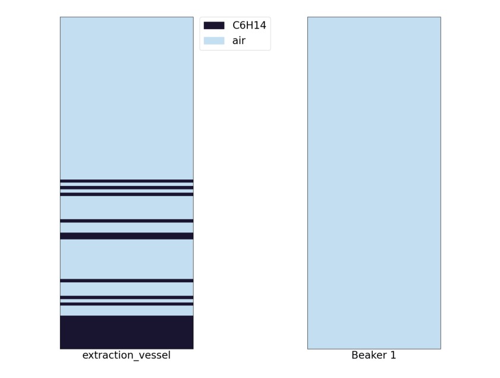
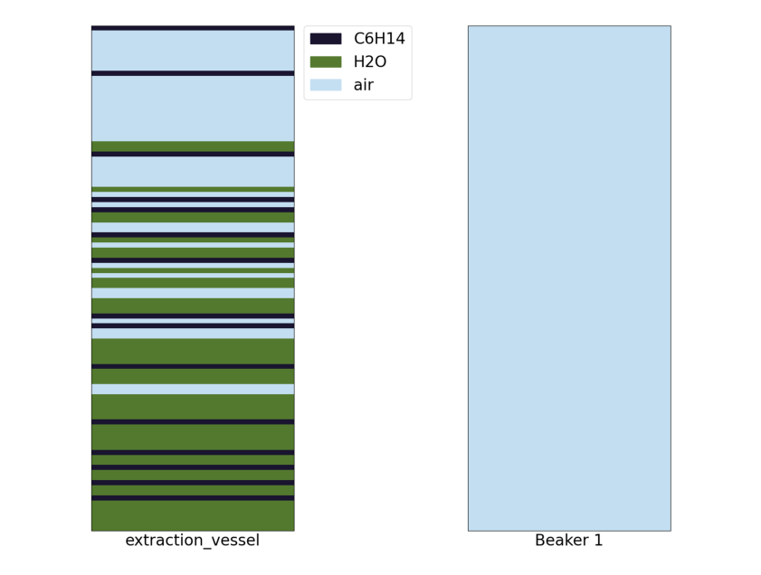

[chemgymrl.com](https://chemgymrl.com/)

## Extraction Bench: Lesson 1

Here is a [link](https://github.com/chemgymrl/chemgymrl/blob/main/lessons/notebooks/extraction_lesson.ipynb) to the jupyter notebook, please use it at your pleasure.

### Using a non-polar solute to extract a solute from water

In this tutorial, I am going to walk you through how our extraction environment works and hopefully give some insight into how an
RL agent might interact with the environment. In this extraction we are going to be using oil to extract sodium and
chlorine from water. We are going to be using this jupyter notebook in order to interact
with the environment.


```python
import sys
sys.path.append('../')
sys.path.append('../chemistrylab/reactions')
import gym
import chemistrylab
import numpy as np
from gym import envs
all_envs = envs.registry.all()
env_ids = [env_spec.id for env_spec in all_envs if 'Extract' in env_spec.id]
print(env_ids)
env = gym.make('WaterOilExtract-v1')
render_mode = "human"
action_set = ['Draining from ExV to Beaker1', 'Mix ExV', 'Pour from B1 to ExV', 'Pour from B1 to B2',
              'Pour from ExV to B2', 'Add oil', 'Add water', 'Done']

```

```commandline
    ['GenWurtzExtract-v1', 'WurtzExtract-v1', 'WurtzExtractCtd-v1', 'WaterOilExtract-v1']
```

So start by running the code cell below you should see a series of graphs like these appear:




```python
state = env.reset()
env.render(mode=render_mode, nb=True)
```

These graphs show the contents of each of our containers and the level of separation between the materials. The graphs
to the right then show the layers of materials forming in the container.

When we start the environment we will see that we have a container filled with water, Na, and Cl. The objective of this
environment is to get the Na out of the water, but how might we do this? As the chemists among us will say this is a
very simple task, and indeed it is. Using a non-polar solvent we can get the sodium and chlorine to diffuse from the
water into that solvent, in this case, we can use oil as our non-polar solvent!

Before we start playing around with the environment, let's take a look at
the action space. For this case our action space is a matrix: {0, 1}<sup>n_action x multiplier</sup> in essence at each
time step the RL agent selects from a set of actions and then in turn picks a multiplier for that action.

As an example, the agent might want to pour a certain amount of solution out of our container, so the row controls what action they take,
and the column represents an action multiplier. So in the example of pouring out a certain amount of solution, the
multiplier might control how much of the solution we pour out of our container. so our action matrix will thus be a
matrix of zeroes with a single 1. In the setup of the environment we select a dT, this dT represents the period of time
we take in between each action. Now that we have a better idea of our action space we can move on to testing out the
environment. As stated earlier we need to use oil to extract the sodium from the water, but if we look at the graph now,
we can clearly see that there is no oil in the container, so let's add some!


<a style="font-size: 10px">(source: https://www.wannapik.com/ author: WannapikStudio)</a>


```python
done = False
state = env.reset()
total_reward = 0
reward = 0
env.render(mode=render_mode, nb=True)
print(f'reward: {reward}')
print(f'total_reward: {total_reward}')
print('======================================================')
action = np.array([5, 1])
state, reward, done, _ = env.step(action)
total_reward += reward
```

Now that we've added the oil we need to mix the vessel to get the sodium to transfer into the oil, so let's mix the
vessel! As seen in the graph below we can see that based on the layer representation that we have mixed the oil and the water.


<a style="font-size: 10px" href="https://commons.wikimedia.org/wiki/File:Magnetic_Stirrer.JPG">User:Ruhrfisch</a>, <a style="font-size: 10px" href="http://creativecommons.org/licenses/by-sa/3.0/">CC BY-SA 3.0</a> <a style="font-size: 10px">, via Wikimedia Commons</a>




```python
env.render(mode=render_mode, nb=True)
print(f'reward: {reward}')
print(f'total_reward: {total_reward}')
print('======================================================')
action = np.array([1, 4])
state, reward, done, _ = env.step(action)
total_reward += reward
```

Now that we have done some mixing we need to wait for the oil to settle to the top of the water so we can drain the
water. Keep repeating the following command until the graph settles.


<a style="font-size: 10px">(source: https://snappygoat.com)</a>


```python
env.render(mode=render_mode, nb=True)
print(f'reward: {reward}')
print(f'total_reward: {total_reward}')
print('======================================================')
action = np.array([0, 0])
state, reward, done, _ = env.step(action)
total_reward += reward
```

Now that the water and oil have settled we want to drain out our water into beaker 1 so that we can pour out our oil
into vessel 2.

<a style="font-size: 10px">(source: https://chem.libretexts.org/Bookshelves/Organic_Chemistry/Book%3A_Organic_Chemistry_Lab_Techniques_(Nichols)/04%3A_Extraction/4.06%3A_Step-by-Step_Procedures_For_Extractions)</a>


```python
# Change me!
action_muiltiplier = 4

env.render(mode=render_mode, nb=True)
print(f'reward: {reward}')
print(f'total_reward: {total_reward}')
print('======================================================')
action = np.array([0, action_multiplier])
state, reward, done, _ = env.step(action)
total_reward += reward
```


Now we pour the oil into vessel 2.


<a style="font-size: 10px">(source: https://www.wannapik.com/ author: WannapikStudio)</a>


```python
env.render(mode=render_mode, nb=True)
print(f'reward: {reward}')
print(f'total_reward: {total_reward}')
print('======================================================')
action = np.array([4, 4])
state, reward, done, _ = env.step(action)
total_reward += reward
```

Now if we want to we can pour back the water from vessel 1 into our extraction vessel and repeat the process to get more of the sodium out of the oil. However, for an introduction, this much should satisfy, now that we have finished,
we want to see how well we did so now we enter the done command.


```python
env.render(mode=render_mode, nb=True)
print(f'reward: {reward}')
print(f'total_reward: {total_reward}')
print('======================================================')
action = np.array([7, 0])
state, reward, done, _ = env.step(action)
total_reward += reward
```

I hope this tutorial helped with your understanding of how an agent might interact with the extraction environment!
