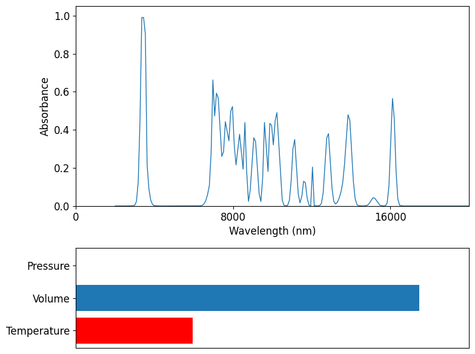

[chemgymrl.com](https://chemgymrl.com/)

# Reaction Bench

<span style="display:block;text-align:center">

The reaction bench is intended to receive an input vessel container and perform a series of reactions on the materials in that vessel, step-by-step, in the aim to yield a sufficient amount of a desired material. After performing sufficiently many reactions to acquire the desired material, the reaction bench outputs a vessel containing materials, including reactants and products in some measure, that may be operated on in subsequent benches.

The inputted vessel is interpreted to be frozen in time and has been allowed to evolve or react in any way. Once the vessel is subjected to the reaction bench, time is allowed to flow and reactions are allowed to occur resulting in changes in the amounts of materials in the vessel. Once the agent operating in the reaction bench deems that a sufficient number of reaction iterations have occurred, the vessel is once again frozen in time, removed from the reaction bench, and put into storage ready to be withdrawn and inputted into other benches.

Put simply, the reaction bench allows reactions to occur and products to be generated. The reactions that are to occur in the reaction bench are determined by selecting a family of reactions from a directory of supported, available reactions. Moreover, if no materials in the input vessel are involved in the selected family of reactions, no reactions will occur. The agent operating on this bench has the ability to modify reaction parameters, such as the volume and temperature of the vessel to promote or demote reactions thus increasing or decreasing the yield of certain reactants and products. The key to the agent’s success in this bench is to learn how best to allow certain reactions to occur such that the yield of the desired product at the conclusion of the experiment is maximized.

When the agent performs enough positive actions and is satisfied with the amount of the desired result, it concludes the experiment and outputs the vessel. However, the reward system is not as simple as maximizing the amount of a material. Also involved are the costs associated with running the experiment and leveraging the costs of the input materials provided in the initial vessel. Managing these costs and benefits is part of the agent learning how best to operate in the reaction bench.

## Input

The input to the reaction bench is initialized in the `reaction_bench_v1.py` file. 

```python
class GeneralWurtzReact_v2(GenBench):
    """
    Class to define an environment which performs a Wurtz extraction on materials in a vessel.
    """
    metadata = {
        "render_modes": ["rgb_array"],
        "render_fps": 10,
    }
    def __init__(self):
        r_rew = RewardGenerator(use_purity=False,exclude_solvents=False,include_dissolved=False)
        shelf = Shelf([
            get_mat("diethyl ether",4,"Reaction Vessel"),
            get_mat("1-chlorohexane",1),
            get_mat("2-chlorohexane",1),
            get_mat("3-chlorohexane",1),
            get_mat("Na",3),
        ])
        actions = [
            Action([0],    [ContinuousParam(156,307,0,(500,))],  'heat contact',   [0],  0.01,  False),
            Action([1],    [ContinuousParam(0,1,1e-3,())],      'pour by percent',  [0],   0.01,   False),
            Action([2],    [ContinuousParam(0,1,1e-3,())],      'pour by percent',  [0],   0.01,   False),
            Action([3],    [ContinuousParam(0,1,1e-3,())],      'pour by percent',  [0],   0.01,   False),
            Action([4],    [ContinuousParam(0,1,1e-3,())],      'pour by percent',  [0],   0.01,   False),
        ]

        react_info = ReactInfo.from_json(REACTION_PATH+"/chloro_wurtz.json")
        
        super(GeneralWurtzReact_v2, self).__init__(
            shelf,
            actions,
            ["PVT","spectra","targets"],
            targets=react_info.PRODUCTS,
            default_events = (Event("react", (Reaction(react_info),), None),),
            reward_function=r_rew,
            discrete=False,
            max_steps=20
        )
```

In here we pass parameters such as the materials and solutes needed for the experiment, the path to an input vessel 
(if we're including one), the output vessel path, the number of time steps to be taken during each action, the amount
of time taken in each time step, and an indication to show if spectral plots show overlapping. 

We also pass in a reaction event which is constructed using a json file located in `chemistrylab/reactions/available_reactions`. This file includes important values that the engine will use to simulate the reaction. It contains information on the reactants, products, and solutes available to the reaction. Additionally, it includes arrays for the activation energy, stoichiometric coefficients, and concentration calculation coefficients. 

## Output

Once the reaction bench is reset and the render function is called, plots will appear showing data about the reaction 
being performed by the agent.

- Render
    - Plots thermodynamic variables and spectral data. The human render plots a minimal amount of data and provides a 
    'surface-level' understanding of the information portrayed.
    - Plots absorbance, time, temperature, volume, pressure, and the amount of reactants remaining.
  

