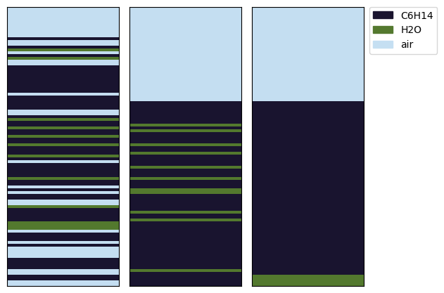

# Vessel: Lesson

[](https://colab.research.google.com/github/chemgymrl/chemgymrl/blob/main/lessons/notebooks/vessel_lesson.ipynb)


## Overview:

In this lesson, we will be going through a class that is vital to the operation of all of our benches, the vessel class.
The source code for this can be found here: `chemistrylab/chem_algorithms/vessel.py`. The vessel class as it is named is
meant to simulate the use of any given you might find in a chemistry lad, such as a beaker or an extraction vessel.
Here we will be going through the important concepts, functions and attributes that make up the vessel class so that you
can easily use it when designing your own reactions.

If you want a more detailed look into each function of the vessel I suggest you go to our [documentation](Vessel) on the data
structure. 

The Vessel class serves as any container you might find in a lab, a beaker, a dripper, etc. The vessel class simulates and allows for any action that you might want to perform within a lab, such as draining contents, storing gasses from a reaction, performing reactions, mix, pour, etc. This is performed using an event queue, which we will look at later in this lesson. First an overview of some of the important variables that make up the vessel class:

Important Variables |Structure | Description
---|---|---
material_dict|{str(material): material, ...}|a dictionary holding all the material inside this vessel
solvents| [str(material), ...] | A list of solute names
solute_dict|{str(solute): array[len(solvents)] , ...}| dictionary that represents the solution


### An example vessel:


```python

from chemistrylab import vessel,material
from chemistrylab.util import Visualization
from IPython.display import display,clear_output,HTML
from copy import deepcopy
Visualization.use_mpl_light(size=1)


v=vessel.Vessel("A")
H2O = material.H2O(mol=1)
Na,Cl = material.NaCl().dissolve().keys()
Na.mol=Cl.mol=1
C6H14 = material.C6H14(mol=1.0)
ether=material.DiEthylEther(mol=0.5)
dodecane = material.Dodecane(mol=2)

v.material_dict={str(Na):Na,str(Cl):Cl,str(C6H14):C6H14,str(H2O):H2O,str(dodecane):dodecane}

v.validate_solvents()
v.validate_solutes()

display(v.get_material_dataframe(), v.get_solute_dataframe())
```


<style type="text/css">
</style>
<table id="T_c6874" style='display:inline'>
  <caption>Materials</caption>
  <thead>
    <tr>
      <th class="blank level0" >&nbsp;</th>
      <th id="T_c6874_level0_col0" class="col_heading level0 col0" >Amount</th>
      <th id="T_c6874_level0_col1" class="col_heading level0 col1" >Phase</th>
      <th id="T_c6874_level0_col2" class="col_heading level0 col2" >Solute</th>
      <th id="T_c6874_level0_col3" class="col_heading level0 col3" >Solvent</th>
    </tr>
  </thead>
  <tbody>
    <tr>
      <th id="T_c6874_level0_row0" class="row_heading level0 row0" >Na</th>
      <td id="T_c6874_row0_col0" class="data row0 col0" >1.000000</td>
      <td id="T_c6874_row0_col1" class="data row0 col1" >l</td>
      <td id="T_c6874_row0_col2" class="data row0 col2" >True</td>
      <td id="T_c6874_row0_col3" class="data row0 col3" >False</td>
    </tr>
    <tr>
      <th id="T_c6874_level0_row1" class="row_heading level0 row1" >Cl</th>
      <td id="T_c6874_row1_col0" class="data row1 col0" >1.000000</td>
      <td id="T_c6874_row1_col1" class="data row1 col1" >l</td>
      <td id="T_c6874_row1_col2" class="data row1 col2" >True</td>
      <td id="T_c6874_row1_col3" class="data row1 col3" >False</td>
    </tr>
    <tr>
      <th id="T_c6874_level0_row2" class="row_heading level0 row2" >C6H14</th>
      <td id="T_c6874_row2_col0" class="data row2 col0" >1.000000</td>
      <td id="T_c6874_row2_col1" class="data row2 col1" >l</td>
      <td id="T_c6874_row2_col2" class="data row2 col2" >False</td>
      <td id="T_c6874_row2_col3" class="data row2 col3" >True</td>
    </tr>
    <tr>
      <th id="T_c6874_level0_row3" class="row_heading level0 row3" >H2O</th>
      <td id="T_c6874_row3_col0" class="data row3 col0" >1.000000</td>
      <td id="T_c6874_row3_col1" class="data row3 col1" >l</td>
      <td id="T_c6874_row3_col2" class="data row3 col2" >False</td>
      <td id="T_c6874_row3_col3" class="data row3 col3" >True</td>
    </tr>
    <tr>
      <th id="T_c6874_level0_row4" class="row_heading level0 row4" >dodecane</th>
      <td id="T_c6874_row4_col0" class="data row4 col0" >2.000000</td>
      <td id="T_c6874_row4_col1" class="data row4 col1" >l</td>
      <td id="T_c6874_row4_col2" class="data row4 col2" >True</td>
      <td id="T_c6874_row4_col3" class="data row4 col3" >False</td>
    </tr>
  </tbody>
</table>
   <style type="text/css">
</style>
<table id="T_6630b" style='display:inline'>
  <caption>Solutes</caption>
  <thead>
    <tr>
      <th class="blank level0" >&nbsp;</th>
      <th id="T_6630b_level0_col0" class="col_heading level0 col0" >C6H14</th>
      <th id="T_6630b_level0_col1" class="col_heading level0 col1" >H2O</th>
    </tr>
  </thead>
  <tbody>
    <tr>
      <th id="T_6630b_level0_row0" class="row_heading level0 row0" >Na</th>
      <td id="T_6630b_row0_col0" class="data row0 col0" >0.500000</td>
      <td id="T_6630b_row0_col1" class="data row0 col1" >0.500000</td>
    </tr>
    <tr>
      <th id="T_6630b_level0_row1" class="row_heading level0 row1" >Cl</th>
      <td id="T_6630b_row1_col0" class="data row1 col0" >0.500000</td>
      <td id="T_6630b_row1_col1" class="data row1 col1" >0.500000</td>
    </tr>
    <tr>
      <th id="T_6630b_level0_row2" class="row_heading level0 row2" >dodecane</th>
      <td id="T_6630b_row2_col0" class="data row2 col0" >1.000000</td>
      <td id="T_6630b_row2_col1" class="data row2 col1" >1.000000</td>
    </tr>
  </tbody>
</table>
   


To briefly describe above, the material_dict describes the materials contained within a vessel and the quantity of that material. The material dict is a dictionary of (material.name, material instance) pairs. As for the solute dict, it represents how much each solute is dissolved in each solvent. Above we can see that each solute is dissolved in 50% water and 50% oil.


Next we will look at some of the important functions that we will need to use with the vessel class:

Important functions | Description
---|---
push_event_to_queue()|used to pass event into the vessel
validate_solvents()| Call when manually updating the material dict in order to update the solvent list
validate_solutes()| Call when manually updating the material dict in order to update the solute_dict

From the list above, the most important function is push_event_to_queue(). The rest of the functions are generally handeled in the backend.

#### Event Functions
Function Name|Description
---|---
'pour by volume'|Pour from self vessel to target vessel by certain volume
'pour by percent'| Pour a fraction of all contents in one vessel into another
'drain by pixel|Drain from self vessel to target vessel by certain pixel
'mix'| Shake the vessel or let it settle
'update_layer'|Update self vessel's layer representation
'change heat'| Add or remove heat from the vessel,
'heat contact'| Connect the vessel to a reservoir for heat transfer,


```python
v2,v3 = deepcopy(v),deepcopy(v)
v.label,v2.label,v3.label = "Fully Mixed","Partially Mixed", "Settled"
v.push_event_to_queue([vessel.Event('mix',[-1],None)],0)
v2.push_event_to_queue([vessel.Event('mix',[0.02],None)])
v3.push_event_to_queue([vessel.Event('mix',[0.5],None)])


Visualization.matplotVisualizer.display_vessels([v,v2,v3],["layers"])

display(
    v.get_solute_dataframe(), 
    v2.get_solute_dataframe(), 
    v3.get_solute_dataframe())
```


    

    


<style type="text/css">
</style>
<table id="T_adeb3" style='display:inline'>
  <caption>Mixed</caption>
  <thead>
    <tr>
      <th class="blank level0" >&nbsp;</th>
      <th id="T_adeb3_level0_col0" class="col_heading level0 col0" >C6H14</th>
      <th id="T_adeb3_level0_col1" class="col_heading level0 col1" >H2O</th>
    </tr>
  </thead>
  <tbody>
    <tr>
      <th id="T_adeb3_level0_row0" class="row_heading level0 row0" >Na</th>
      <td id="T_adeb3_row0_col0" class="data row0 col0" >0.802160</td>
      <td id="T_adeb3_row0_col1" class="data row0 col1" >0.197840</td>
    </tr>
    <tr>
      <th id="T_adeb3_level0_row1" class="row_heading level0 row1" >Cl</th>
      <td id="T_adeb3_row1_col0" class="data row1 col0" >0.802160</td>
      <td id="T_adeb3_row1_col1" class="data row1 col1" >0.197840</td>
    </tr>
    <tr>
      <th id="T_adeb3_level0_row2" class="row_heading level0 row2" >dodecane</th>
      <td id="T_adeb3_row2_col0" class="data row2 col0" >1.604319</td>
      <td id="T_adeb3_row2_col1" class="data row2 col1" >0.395681</td>
    </tr>
  </tbody>
</table>
   <style type="text/css">
</style>
<table id="T_76dd6" style='display:inline'>
  <caption>Partially settled</caption>
  <thead>
    <tr>
      <th class="blank level0" >&nbsp;</th>
      <th id="T_76dd6_level0_col0" class="col_heading level0 col0" >C6H14</th>
      <th id="T_76dd6_level0_col1" class="col_heading level0 col1" >H2O</th>
    </tr>
  </thead>
  <tbody>
    <tr>
      <th id="T_76dd6_level0_row0" class="row_heading level0 row0" >Na</th>
      <td id="T_76dd6_row0_col0" class="data row0 col0" >0.756367</td>
      <td id="T_76dd6_row0_col1" class="data row0 col1" >0.243633</td>
    </tr>
    <tr>
      <th id="T_76dd6_level0_row1" class="row_heading level0 row1" >Cl</th>
      <td id="T_76dd6_row1_col0" class="data row1 col0" >0.756367</td>
      <td id="T_76dd6_row1_col1" class="data row1 col1" >0.243633</td>
    </tr>
    <tr>
      <th id="T_76dd6_level0_row2" class="row_heading level0 row2" >dodecane</th>
      <td id="T_76dd6_row2_col0" class="data row2 col0" >1.649199</td>
      <td id="T_76dd6_row2_col1" class="data row2 col1" >0.350801</td>
    </tr>
  </tbody>
</table>
   <style type="text/css">
</style>
<table id="T_b7222" style='display:inline'>
  <caption>Fully Settled</caption>
  <thead>
    <tr>
      <th class="blank level0" >&nbsp;</th>
      <th id="T_b7222_level0_col0" class="col_heading level0 col0" >C6H14</th>
      <th id="T_b7222_level0_col1" class="col_heading level0 col1" >H2O</th>
    </tr>
  </thead>
  <tbody>
    <tr>
      <th id="T_b7222_level0_row0" class="row_heading level0 row0" >Na</th>
      <td id="T_b7222_row0_col0" class="data row0 col0" >0.674302</td>
      <td id="T_b7222_row0_col1" class="data row0 col1" >0.325698</td>
    </tr>
    <tr>
      <th id="T_b7222_level0_row1" class="row_heading level0 row1" >Cl</th>
      <td id="T_b7222_row1_col0" class="data row1 col0" >0.674302</td>
      <td id="T_b7222_row1_col1" class="data row1 col1" >0.325698</td>
    </tr>
    <tr>
      <th id="T_b7222_level0_row2" class="row_heading level0 row2" >dodecane</th>
      <td id="T_b7222_row2_col0" class="data row2 col0" >1.999999</td>
      <td id="T_b7222_row2_col1" class="data row2 col1" >0.000001</td>
    </tr>
  </tbody>
</table>
   

## Customizing the event queue

You can add custom events to the Vessel class by registering them with `Vessel.register(f: Callable, f_id: str)`. Functions must be of the following form:
```python
f(vessel: Vessel, dt: float, other_vessel: Optional[Vessel], *args)
```
This will correspond to an Event of the form
```python
Event(f_id, args, other_vessel)
```

Below is an example of how to register a custom function:

```python

from chemistrylab.chem_algorithms.vessel import Vessel,Event
from chemistrylab.chem_algorithms.material import Material,H2O
from typing import NamedTuple, Tuple, Callable, Optional

def add_material(vessel: Vessel, dt: float, other_vessel: Optional[Vessel], material: Material):
    """
    Custom method to add a material to the vessel's material dict
    
    Args:
    - vessel (Vessel): The vessel you want to put the material in
    - dt (unused): How much time has passed
    - other_vessel (unused): A second affected vessel
    - material (Material): The material to add
    
    """
    assert other_vessel is None
    key = str(material)
    materials=vessel.material_dict
    if key in materials:
        materials[key].mol+=material.mol
    else:
        # Create a new material with the same class and number of mols
        materials[key] = material.ration(1)

    # Rebuild the vessel's solute dict if new solvents have been added
    vessel.validate_solvents()
    vessel.validate_solutes()
    return vessel._handle_overflow()

Vessel.register(add_material,"add material")


v = Vessel("Test Vessel")
event = Event("add material",(H2O(mol=1),),None)
v.push_event_to_queue([event])

display(v.get_material_dataframe())
```


### The Workflow
  
  1. Agent choose action from the action space of an environment.
  2. The environment does the calculation and update and generate events.
  3. At the end of each action, if the action affect a vessel, use push_event_to_queue() to push the event into the vessel, if no event generated, call the function with events=None.
  4. With push_event_to_queue() called, events are pushed into the vessel.
  5. _update_materials is automatically called and perform events in the events_queue.
  6. Each event has a corresponding event function, it first update properties of the vessel, then loop over the materials inside the vessel by calling the corresponding event functions of each material.
  7. The materials' event function will return feedback by calling the push_event_to_queue(), which contains feedback and unfinished event 
  8. The returned feedback is added to the _feedback_queue
  9. The the _merge_event_queue() is called on _feedback_queue, which merge the events in the feedback_queue to generate a merged_queue and add default event into it, then empty the _feedback_queue
  10. Then the merged_queue will be executed and new feedback are collected and added to _feedback_queue, which will be executed with the next action. 


