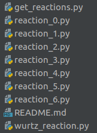

## Building A Custom Reaction File

For this tutorial we are going to be creating a very simple reaction 

NaCl<sub>aq</sub> ->  Na<sup>+</sup><sub>aq</sub> + Cl<sup>-</sup><sub>aq</sub>

In order to start with creating an environment for this reaction we first have to create a reaction file which simulates
the mechanics of this decomposition. </br></br> In the directory ```chemistrylab/reactions``` you will find a list of
reactions that looks something like this:



For this case we will create a new reaction file from the reaction template file ```template_reaction.py```,
and let's name it ```decomp_reaction.py```.

The first change we have to make is to the list of reactants, products and solutes located at line 42

```python
# names of the reactants and products in all reactions
# a list of the names of all reactants that are to be used in a reaction
REACTANTS = []
# a list of all the names of the reactants that are going to be produced by the reaction
PRODUCTS = []
ALL_MATERIALS = REACTANTS + PRODUCTS
# specify the solute in which the reaction is meant to take place in
SOLUTES = []
```
we change the above to the following:
```python
REACTANTS = ['NaCl']
PRODUCTS = ['Na', 'Cl']
ALL_MATERIALS = REACTANTS + PRODUCTS
SOLUTES = ['H2O']
```

In this case we are letting the reaction file know what reagents we are using and the desired product so that we can
easily track and display their concentrations.

Next up we have to look at our spectra parameters. The specification of which exact spectra variables we use is not
important, but it is important to have the right number of spectra so we can generate absorbance data. The following
line of code is located at line 126 in the initialization function of the `Reaction` class
```python
if overlap:
    # add spectra to params make sure to add spectra as required
    self.params.append(spec.S_1)
else:
    # add spectra to params make sure to add spectra as required
    self.params.append(spec.S_1)
```

We change the above to look like:

```python
if overlap:
    self.params.append(spec.S_3_3)  # spectra for NaCl
    self.params.append(spec.S_6) # spectra for the Na
    self.params.append(spec.S_7) # spectra for the Cl
else:
    self.params.append(spec.S_8) # spectra for NaCl
    self.params.append(spec.S_1) # spectra for the Na
    self.params.append(spec.S_3) # spectra for the Cl
```
A note on the spectra that the numbers have no significance, so feel free to pick any spectra you wish. 
Now that we have our spectra corrected we now have to change the update function of our file. For these reactions we use
an ODE solver to calculate the change in concentration over time. As such we have to change some parameters on how we
update the rates of reaction.

```python
# obtain the concentration (all concentrations are in mol/m**3)
C = self.get_concentration(V)

# define a space to contain the changes in concentration to each chemical
dC = np.zeros(self.n.shape[0])

# define the reaction constant for each reaction
k1 = A1 * np.exp((-1 * E1)/(R * T))

# define the rate of each reaction
self.rate[0] = k1 * C[0] * dt

# calculate and store the changes in concentration of each chemical
dC[0] = (-1.0 * self.rate[0])
dC[1] = (1.0 * self.rate[0])
dc[2] = (1.0 * self.rate[0])
```

In this case we don't need to update these parameters but depending on the number of simultaneous reactions
and the rates and how they relate to the concentration of a substance there will need to be additional parameters added,
this can be seen in `wurtz_reaction.py`:

```python
# set the pre-exponential constant using the above scaling factor for proper dimensionality
        A0 = 1.0 / scaling_factor # Reaction 0
        A1 = 1.0 / scaling_factor # Reaction 1
        A2 = 1.0 / scaling_factor # Reaction 2
        A3 = 1.0 / scaling_factor # Reaction 3
        A4 = 1.0 / scaling_factor # Reaction 4
        A5 = 1.0 / scaling_factor # Reaction 5

        # set the activation energies for each reaction constant
        E0 = 1.0
        E1 = 1.0
        E2 = 1.0
        E3 = 1.0
        E4 = 1.0
        E5 = 1.0

        # define the reaction constant for each reaction;
        k0 = A0 * np.exp((-1 * E0)/(R * T))
        k1 = A1 * np.exp((-1 * E1)/(R * T))
        k2 = A2 * np.exp((-1 * E2)/(R * T))
        k3 = A3 * np.exp((-1 * E3)/(R * T))
        k4 = A4 * np.exp((-1 * E4)/(R * T))
        k5 = A5 * np.exp((-1 * E5)/(R * T))

        # define the rate of each reaction;
        # note the reactants in the concentration array (C) are in
        # the order of the reactants in the `REACTANTS` variable;
        # using the stoichiometric ratio in the rate exponentials gives the following rates:
        self.rate[0] = k0 * (C[0] ** 2) * (C[1] ** 0) * (C[2] ** 0) * (C[3] ** 1)
        self.rate[1] = k1 * (C[0] ** 1) * (C[1] ** 1) * (C[2] ** 0) * (C[3] ** 1)
        self.rate[2] = k2 * (C[0] ** 1) * (C[1] ** 0) * (C[2] ** 1) * (C[3] ** 1)
        self.rate[3] = k3 * (C[0] ** 0) * (C[1] ** 2) * (C[2] ** 0) * (C[3] ** 1)
        self.rate[4] = k4 * (C[0] ** 0) * (C[1] ** 1) * (C[2] ** 1) * (C[3] ** 1)
        self.rate[5] = k5 * (C[0] ** 0) * (C[1] ** 0) * (C[2] ** 2) * (C[3] ** 1)

        # calculate and store the changes in concentration of each chemical;
        # recall: change in concentration = molar concentration * rate * dt
        # ie. for A + 2B --> C and A + C --> D as parallel reactions
        # change in A = (-1 * rate of reaction 1 * dt) + (-1 * rate of reaction 2 * dt)
        # change in B = (-2 * rate of reaction 1 * dt)
        # change in C = (+1 * rate of reaction 1 * dt) + (-1 * rate of reaction 2 * dt)
        # change in D = (+1 * rate of reaction 2 * dt)
        # assuming both reactions have the same time-step, which is true for all reactions in this file
        dC[0] = (-2.0 * self.rate[0]) + (-1.0 * self.rate[1]) + (-1.0 * self.rate[2]) * dt # change in 1-chlorohexane
        dC[1] = (-1.0 * self.rate[1]) + (-2.0 * self.rate[3]) + (-1.0 * self.rate[4]) * dt # change in 2-chlorohexane
        dC[2] = (-2.0 * self.rate[2]) + (-1.0 * self.rate[4]) + (-2.0 * self.rate[5]) * dt # change in 3-chlorohexane
        dC[3] = -2.0 * (self.rate[0] + self.rate[1] + self.rate[2] + self.rate[3] + self.rate[4] + self.rate[5]) * dt # change in Na
        dC[4] = 1.0 * self.rate[0] * dt # change in dodecane
        dC[5] = 1.0 * self.rate[1] * dt # change in 5-methylundecane
        dC[6] = 1.0 * self.rate[2] * dt # change in 4-ethyldecane
        dC[7] = 1.0 * self.rate[3] * dt # change in 5,6-dimethyldecane
        dC[8] = 1.0 * self.rate[4] * dt # change in 4-ethyl-5-methylnonane
        dC[9] = 1.0 * self.rate[5] * dt # change in 4,5-diethyloctane
        dC[10] = 2.0 * (self.rate[0] + self.rate[1] + self.rate[2] + self.rate[3] + self.rate[4] + self.rate[5]) * dt # change in NaCl
```

As far as the reaction file, it is now set up and ready to go. Now inorder to use the reaction we need to make a simple
change to the reaction bench engine located ```chemistrylab/reaction_bench/reaction_bench_v0_engine.py``` in this case
you should duplicate this file and rename the file ```reaction_bench_v0_engine_decomp```

at the top of the file you should see a line like the one below where we import the reaction that the engine will use:

```from chemistrylab.reactions.wurtz_reaction import Reaction```

We will change the import so that we import the new reaction we just created

```from chemistrylab.reactions.decomp_reaction import Reaction```

It will also be easier for us to change the name of the engine class from:

```ReactionBenchEnv```

to

```ReactionBenchEnvDecomp```

We are now onto the last 2 additions that will allow us to use this reaction environment. In this file 
```chemistrylab/reaction_bench/reaction_bench_v0.py``` we are going to add some code that will allow us to initialize
our new reaction environment so that we can then register it and use it.

At the bottom of this file we will add the following lines of code:

```python
class ReactionBenchEnv_1(ReactionBenchEnvDecomp):
    def __init__(self):
        super(ReactionBenchEnv_1, self).__init__(
            materials=[
                {"Material": "NaCl", "Initial": 1},
            ],
            solutes=[
                {"Solute": "H2O", "Initial": 1}
            ],
            desired="Na",
            overlap=False
        )
```

This code simply sets up the environement we will be using. So in this case we establish the materials that the reaction
will use and the initial quantity of that substance in mols. We then also establish our solute, in this case, 1 mol of
water. Lastly we specify our desired material so that we can calculate the reward which the RL agent will recieve.
This takes us to the final step which is registering the environment with gym. In this file: 
```chemistrylab/__init__.py``` we are going to add a few more lines of code.

```python
register(
    id='DecompReactLesson-v0',
    entry_point='chemistrylab.reaction_bench.reaction_bench_v0:ReactionBenchEnv_1',
    max_episode_steps=20
)
```

This code simply tells gym where to find our new environment. Now we're done if you run the following code you should
now be able to see our new environment:
```python
from gym import envs

all_envs = envs.registry.all()
env_ids = [env_spec.id for env_spec in all_envs if 'React' in env_spec.id]
print(env_ids)
```
```
#['WurtzReact-v0', 'WurtzReact_overlap-v0', 'DecompReactLesson-v0']
```

Here we can clearly see that our environment has been added!