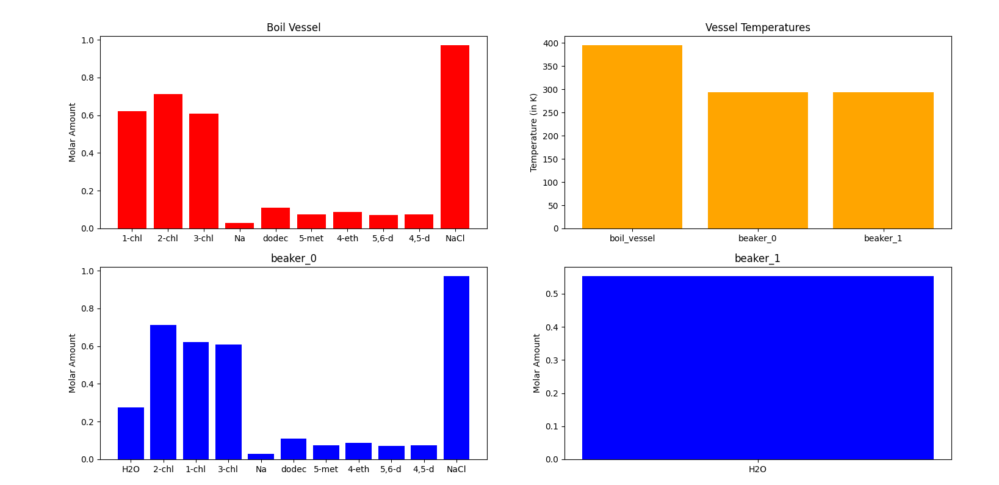

## Distillation Bench: Lesson 1

### Familiarizing Actions for the Distillation Bench

In this tutorial, we will be going through how the distillation environment works. We will be taking the `tests/test_extract_vessel.pickle` which is a pickle file generated when we ran the extraction bench. 

It is important to know that before running the distillation bench, you must first complete both reaction and extraction, in order to follow the workflow our environment. To find out more, take a look at the [readme.md](https://github.com/CLEANit/chemistrygym) file on our github.

Before we start talking about loading and running the environment, let's first familiarize ourselves with what's actually going on in the experiment.

### Distillation Process Explained

In the distillation environment there are 3 main containers or vessels.

| vessel                       | label |
|------------------------------|-------|
| boiling vessel               | BV    |
| beaker 1/condensation vessel | B1    |
| beaker 2/storage vessel      | B2    |

The boiling vessel (BV) contains all the materials at the initial state of the experiment. Beaker 1 (B1) can be thought of as a  condensation vessel which is connected to the distillation vessel via a tube and this will contain all the materials  that are being boiled off. Beaker 2 (B2) is then the storage vessel, where the condensation vessel can be emptied, in order to make room for other material.


The point of the process is to extract a target material from the boiling vessel, which contains numerous materials, and we do this by utilizing the different material's boiling points. Typically the process begins by raising the temperature of the BV which allows certain materials in that vessel to boil off into the condensation vessel or B1. 


As a material's boiling point is reached, any more temperature added from this point will act to evaporate it.  The now gaseous material will rise out of the boiling vessel into the tube that feeds into the condensation vessel where it will condense back into its liquid form. In this virtual experiment  it is assumed that this takes place instantaneously. The amount of material evaporated is dependent on the enthalpy of vapour of material being evaporated. 

Once the entirety of the material has been boiled off, the condensation vessel is drained into the storage vessel. Now 
the condensation vessel is empty, the boiling vessel's temperature can then be raised more until the next lowest boiling point is reached, thus repeating the process.


The process is repeated until the desired material has been completely evaporated from the boiling vessel into  condensation vessel. From this point on the desired material is completely isolated and we obtain a hopefully pure sample. We can then choose to end the experiment.

In lesson 3 in these sets of tutorial for the distillation bench, we will try to get a high reward by obtaining a high molar amount of pure dodecane in our condensation vessel. 

For this tutorial, we will just familiarize ourselves with the basic actions, fundamental theory behind distillation, and how you can run the environment on your own!

### Running the environment

We will first start by importing the necessary required modules, both external and local. By now this step should seem very familiar as we have done them in the reaction and extraction lessons.


```python
%matplotlib inline
```


```python
# import all the required external modules
import gym
import numpy as np
import os
import pickle
import sys
from time import sleep
from gym import envs
import matplotlib.pyplot as plt
import pandas as pd
```


```python
# ensure all necessary modules can be found
sys.path.append('../')
sys.path.append("../chemistrylab/reactions") # to access all reactions
```


```python
# import local modules
import chemistrylab 
```

We can see all the possible variations of the distillation bench environment which can vary depending on the input vessel (in this case the `test_extract_vessel.pickle`), which is loaded into the boil vessel, as well as the target material. In this and following tutorials our target material will be dodecane


```python
# show all environments for distillation bench
all_envs = envs.registry.all()
env_ids = [env_spec.id for env_spec in all_envs if 'Distillation' in env_spec.id]
print(env_ids)
```

We then get prompted with a message asking us to choose the environment we want to run. This is based off the indexing in the environment array we saw from the last cell.


```python
# allows user to pick which environment they want to use
# initializes environment
select_env = int(input(f"Enter a number to choose which environment you want to run (0 - {len(env_ids) - 1}): \n"))
env = gym.make(env_ids[select_env])
render_mode = "human" #select how graphs are rendered
```

We initialize done to False so our agent can run the experiment. We run reset() to return an initial observation.


```python
done = False
__ = env.reset()
print('\n')
```

Here we have the different possible actions that we can take with the environment. The **action_set is an array indexed correspondingly to the action we want to perform.**

The action_space is a multidiscrete action space of shape [6 10].

**The first index allows us to choose from the action set. The second index allows us to pick a multiplier that will affect the action variably depending on our chosen multiplier.**

For example, the following pair of numbers will add a great amount of heat compared to a multiplier of 6. 

Action: 0

Action Multiplier: 10

Here is a complete explanation of each action. Again, action[0] indicates the the event which is to take place. Action[1] is a number representing the multiplier for the event.

| action[0] |                                                                          |
|-----------|--------------------------------------------------------------------------|
| 0         | Add/Remove Heat (Heat Value multiplier, relative of maximal heat change) |
| 1         | Pour BV into B1 (Volume multiplier, relative to max_vessel_volume)       |
| 2         | Pour B1 into B2 (Volume multiplier, relative to max_vessel_volume)       |
| 3         | Pour B1 into BV (Volume multiplier, relative to max_vessel_volume)       |
| 4         | Pour B2 into BV (Volume multiplier, relative to max_vessel_volume)       |
| 5         | Done (Value doesn't matter)                                              |


```python
action_set = ['Add/Remove Heat', 'Pour BV into B1', 'Pour B1 into B2', 'Pour B1 into BV', 'Pour B2 into BV', 'Done']
assert env.action_space.shape[0] == 2

total_steps=0
total_reward=0
```

Note that the multiplier affects each action differently. For examply the way the agents chosen multiplier affects heat change is given by the following code:


Typically an agent will choose actions based on what will give a higher reward, and higher reward is given by getting a high molar amount and concentraion of the desired material (in our case dodecane) in a particular vessel.

Please input the following action and multipliers:

| Step   | Action   | Multiplier  |
| ------ |:--------:| -----:      |
| 0      | 0        | 8           |
| 1      | 2        | 10          |
| 2      | 0        | 6           |
| 3      | 3        | 10          |
| 4      | 1        | 10          |
| 5      | 4        | 10          |
| 6      | 5        | 0           |


```python
while not done:

    action = np.zeros(env.action_space.shape[0])

    for index, action_desc in enumerate(action_set):
        print(f'{index}: {action_desc}')
    print('Please enter an action and an action multiplier')
    for i in range(2):
        message = 'Action'
        if i == 1:
            message = 'Action Multiplier:'
        action[i] = int(input(f'{message}: '))


    # perform the action and update the reward
    state, reward, done, __ = env.step(action)
    print('-----------------------------------------')
    print('total_steps: ', total_steps)
    print('reward: %.2f ' % reward)
    total_reward += reward
    print('total reward: %.2f ' % total_reward)
    print('Temperature of boiling vessel: %.1f ' % env.boil_vessel.temperature, ' K \n')
    # print(state)
    
    # render the plot
    env.render(mode=render_mode)
    # sleep(1)
    
    #increment one step
    total_steps += 1
```

#### Step 0: Adding temperature to the vessel

| action | multiplier |
|--------|------------|
| 0      | 8          |

This will result in a temperature reaching the boiling point of water, which you will notice is now boiled off in beaker_0 (or the condensation vessel)


#### Step 1: Pour from condensation to storage vessel

| action | multiplier |
|--------|------------|
| 2      | 10          |

We can then see that storage vessel is now filled with the H2O poured from the condensation vessel. 

****plot not fixed yet****


#### Step 2: Add some more temperature

| action | multiplier |
|--------|------------|
| 0      | 6          |


#### Step 3: Pouring back from condensation vessel to boiling vessel

| action | multiplier |
|--------|------------|
| 3      | 10         |

You should see now that everything from the condensation vessel is back in the boiling vessel.

**---Should insert graph here but it doesn't show the action correctly---**

#### Step 4: Pour everything from boiling vessel into condensation vessel

| action | multiplier |
|--------|------------|
| 1      | 10         |

Notice now that all the materials are in the condensation vessel.



#### Step 5: Pour the originally boiled off H2O in the storage vessel into the boiling vessel

| action | multiplier |
|--------|------------|
| 4      | 10         |

Now you can see that the H2O which was previously in the storage vessel, is now in the boiling vessel.


#### Step 6: Ending the experiment

| action | multiplier |
|--------|------------|
| 5      | 0          |

### End of the lesson

This concludes the end of our tutorial. Hopefully you got a chance to see how the basic actions in the distillation environment works and see how you can use the agent in RL applications to maximize the distillation of a desired material.

In the next tutorial we will perform 2 experiments where we heat up the boiling vessel to the maximum temperature it can reach, and vice versa where we cool it to the lowest temperature.
